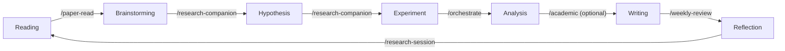
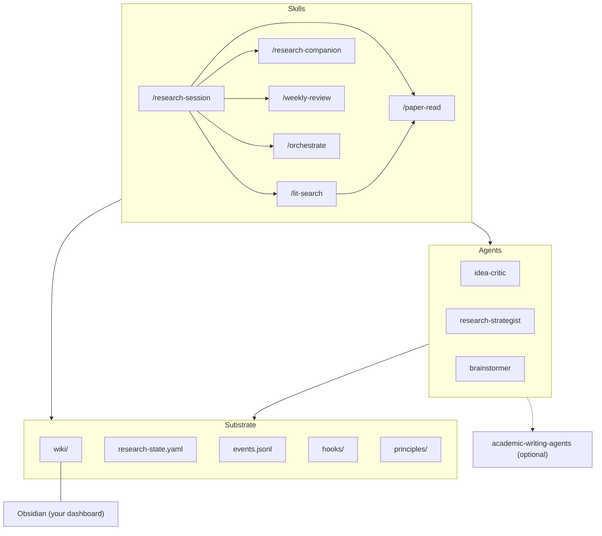

# Researcher Pack

The LLM-research toolkit you actually have is a bag of disconnected tools — a chatbot for brainstorming, a summarizer for papers, an autocomplete for writing.
Each is individually impressive.
Nothing compounds.

You park an idea in a chat log on Monday, read a paper in a PDF reader on Wednesday, draft a paragraph in a LaTeX editor on Friday, and by the following week none of these pieces know the others exist.
The chat is gone.
The paper notes are in some download folder.
The draft has drifted.

***researcher-pack is one loop, and you only ever type one command.***

## The one command

`/research-session` is the front door.
When you type it, the skill reads `.claude/research-state.yaml`, scans the wiki for stale topic pages and unrevisited research evaluations, pulls unresolved review findings from recent events, and produces a briefing in under a page.

The briefing tells you three things: what's due, what drifted, what to pick up.
It proposes an agenda, and from that agenda it dispatches to the right sub-skill — `/paper-read` if you want to ingest a single paper, `/lit-search` if you want to map a subfield, `/research-companion` if you want to brainstorm, `/weekly-review` if you want a digest, `/orchestrate` if the job is a multi-stage pipeline.

Everything else triggers automatically.
The `PostToolUse` hook fires on every file write.
The wiki updates in place as you edit.
The auto-commit hook batches changes into commits after a quiet period.
Sub-skills are routed from the session without you remembering the syntax.

One command in, structured work out.
You don't pick the tool — you open the session and the tool finds you.

## The loop

Research doesn't live in any single activity — it lives in the handoffs between them.
The loop below is what researcher-pack keeps turning.
Each arc is powered by a specific skill or agent, and the output of each arc is what the next arc reads on startup.



The arcs are what you type.
The nodes are where the artifacts live — wiki topic pages, research-evaluation pages, experiment notes, draft sections.

Because every skill reads and writes the same wiki, Reading feeds Brainstorming without a copy-paste.
Reflection on Friday can remind you on Monday what you decided the Friday before.
Nothing needs to be carried in your head between sessions — if it was worth writing down, it's already in a page the next skill will read.

## The components

Under the loop are three layers.
Skills are the things you type.
Agents are the things skills spawn when a task benefits from a fresh context window or an adversarial role.
Substrate is the plain-text state that binds everything — the wiki, the state file, the event log, the hooks, the principles.



`/research-session` is the hub of the Skills layer.
The others fan out from it — you rarely type them directly once the session is running.

The three agents — `idea-critic`, `research-strategist`, and `brainstormer` — are vendored into the pack and live in `agents/`.
Each has its own context window and its own narrow job.
`idea-critic` stress-tests proposals along seven dimensions and returns Pursue/Refine/Kill.
`research-strategist` makes project-level continue/pivot/kill calls, considering comparative advantage, impact forecasting, and scooping risk.
`brainstormer` generates divergence — many variants, many angles, fast.

The Substrate layer is the contract.
Every skill and agent reads and writes these files, and that's how they stay coherent without any direct function calls.
Swap any one tool for a better one and the rest still work, as long as the replacement honors the files.

Obsidian hangs off `wiki/` with a solid edge because it's how you look at the substrate — the recommended viewer, not a required one.
The dashed edge to `academic-writing-agents` is the optional companion plugin, explained in the last section.

## A day in the loop

Monday morning you type `/research-session` and wait for the briefing.
It's three paragraphs long: two topic pages haven't been touched in seven weeks, one research-evaluation you parked three weeks ago has hit its revisit condition, and an unresolved finding from last Friday's weekly review is still sitting there asking for a decision.
You take the parked idea. `/research-companion diffusion-policies-for-manipulation`.
The skill opens the prior research-evaluation page, pulls in the related topic page, and runs Phase 2 with the brainstormer agent — ten variants, six kills, four survivors.
It stress-tests the survivors against `idea-critic`, writes a fresh research-evaluation page with a new verdict, and the auto-commit hook quietly bundles the changes into a commit thirty seconds later.
In the afternoon you ingest two papers with `/paper-read`, and both get woven into the same topic page you were just looking at — when you flip to Obsidian the graph view has already redrawn, two new edges glowing into the topic node.
By Friday you type `/weekly-review` and see exactly what happened: the decisions you made, the drafts you touched but never reviewed, and the topic pages that drifted while you were elsewhere.
The loop closes itself.
You never had to remember to write it down.

## Components

Each component below is one H3 — *what it is*, *when it fires*, *what it writes*, *where to look*.
Use this section as a map when you want to know which file to open.
Every path is relative to the pack repo unless noted otherwise.

### /research-session

The front door.
Reads `.claude/research-state.yaml`, the wiki index, and the tail of `events.jsonl`, then prints a briefing and proposes an agenda.

Fires explicitly — you type it.
Writes a session-start event to `events.jsonl` and updates `last_session` in the state file.
Source: `skills/research-session/SKILL.md`.

### /paper-read

Five-phase paper workflow: Load, Analyze, Discuss, Ingest, Follow-up.
Grounds discussion in existing wiki pages before ingesting so you don't re-learn what you already knew.

Fires explicitly with a path argument.
Writes to `wiki/topics/*.md`, `wiki/concepts/*.md`, `wiki/sources/`, `wiki/log.md`, `wiki/index.md`.
Source: `skills/paper-read/SKILL.md`.

### /lit-search

Persistent, per-topic literature-mapping workspace.
Runs disciplined multi-angle searches (cross-domain synonyms, enabling mechanisms, motivating applications) across Semantic Scholar, WebSearch, and venue-specific queries, then curates results into a scratchpad folder you can return to across sessions.

Fires explicitly with a topic phrase — e.g. `/lit-search micro-macro validation in ABM` — or with `@<existing-topic>` to resume.
Writes `wiki/queries/<topic>/memory-bank.md`, `mind-graph.md`, and `references.bib`.
Does not duplicate deep-read content: per-paper summaries are delegated to `/paper-read` (which produces `wiki/entities/<short-id>.md`), and PDFs land in `wiki/sources/papers/` through the same chain.
When the `mind-graph` stabilizes, graduates to a `wiki/topics/` or `wiki/syntheses/` page; the workspace folder stays as the audit trail.
Adapted from [bchao1/paper-finder](https://github.com/bchao1/paper-finder) to fit the pack's wiki model.
Source: `skills/lit-search/SKILL.md`.

### /research-companion

Six-phase ideation loop: Seed, Diverge, Evaluate, Deepen, Frame, Decide.
Orchestrates `brainstormer` for divergence and `idea-critic` for stress-testing.
In Decide it writes a `research-evaluation` page with a verdict (PURSUE / PARK / KILL) and optional revisit conditions.

Fires explicitly.
Writes to `wiki/research-evaluations/` and updates the related topic page.
Source: `skills/research-companion/SKILL.md`.

### /weekly-review

Generates a digest from `events.jsonl` and the state file: activity, knowledge growth, drift, priorities.
Not a productivity report — a navigation aid for the following week.

Fires explicitly.
Writes a weekly digest page and a `weekly-review` event.
Source: `skills/weekly-review/SKILL.md`.

### /orchestrate

Meta-skill for multi-stage pipelines — paper → review → draft, or any case where a single request should fan out to several skills in sequence.

Fires explicitly.
Writes the intermediate artifacts of whichever skills it chains.
Source: `skills/orchestrate/SKILL.md`.

### The wiki

Minimal knowledge-base conventions — topic, concept, group, synthesis, query, and research_evaluation pages, each with YAML frontmatter and `[[wikilinks]]`.
Lives in `wiki/` and is Obsidian-compatible out of the box.

Read `wiki/wiki.schema.md` for the full schema.
The starter wiki lands there on `setup.sh init`.

### State and events

`.claude/research-state.yaml` is the snapshot — path config, wiki counts, last session, suggested actions.
`events.jsonl` (or `.claude/events.jsonl`, depending on your init layout) is the append-only log every skill writes to.

Together they are the bus that closes the loop.
Skills read state on entry and append events on exit.

### Hooks

`hooks/research_hook.sh` is registered as a `PostToolUse` hook on `Write|Edit`.
It dispatches on the modified file's path — wiki edits emit `wiki:update` events, draft edits emit `writing:edit`, research-evaluation edits emit their own event — and updates the state-file timestamp.

`hooks/auto_commit.sh` batches commit-worthy changes behind a 30-second quiet-period debounce.
Both are readable shell scripts.
Fork them.

### Principles

`principles/academic-writing.md` is the prose-quality rulebook the writing-facing skills load.
`principles/research-strategy.md` is the strategic-judgment rulebook `research-strategist` and `/research-companion` consult.

Both are copied into `~/.claude/principles/` at link time so every agent can reach them from anywhere on your machine.

## Your dashboard: Obsidian

The GitHub version of researcher-pack ships with no dashboard of its own.
That's deliberate.
The wiki is plain markdown, and the right dashboard for plain markdown is a markdown viewer you already trust.

We recommend pairing the pack with Obsidian.
The wiki format is already Obsidian-compatible, and the pack ships a starter `.obsidian/` config inside `templates/wiki/` so you get a working graph view on the first open — no plugin-config dance, no theme hunting.

### 60-second setup

Run `setup.sh init`.
It scaffolds the wiki and drops the starter `.obsidian/` into your new wiki directory.
Open Obsidian, choose "Open folder as vault," and point it at `wiki/`.
Done.

If you already have a wiki and just want the config, copy `templates/wiki/.obsidian/` into it by hand.
It's a handful of JSON files.

### What you'll see

On first open you land on the wiki index page.
The file explorer on the left shows the page-type folders: `topics/`, `concepts/`, `groups/`, `syntheses/`, `queries/`, and `research-evaluations/`.

The graph view color-codes nodes by folder: topics = blue, concepts = green, groups = orange, syntheses = purple, queries = teal, research-evaluations = red.
The folder-based coloring relies on your sticking to the conventional directory layout — a topic page accidentally saved to `concepts/` will be colored as a concept. The wiki linter (which flags frontmatter/path mismatches) is the defense against that drift.
Edges are drawn from `[[wikilinks]]` — click any node to jump to the page.

Because the hook updates pages in place, the graph redraws as you work.
A new paper ingestion becomes a new edge within seconds of the `/paper-read` Phase 4 completing.

### Two example Dataview queries

Install the Dataview community plugin from Obsidian Settings → Community Plugins, then drop these into any note.

Stale topic pages (last reviewed more than 60 days ago):

```dataview
TABLE last_reviewed, file.mtime AS "Last Modified"
FROM "topics"
WHERE type = "topic" AND last_reviewed < date(today) - dur(60 days)
SORT last_reviewed ASC
```

PARK research-evaluations whose revisit conditions might now be met:

```dataview
TABLE date, verdict, revisit_conditions
FROM "research-evaluations"
WHERE type = "research_evaluation" AND verdict = "PARK" AND revisit_conditions AND date < date(today) - dur(30 days)
SORT date ASC
```

Both queries live in Obsidian only.
The pack itself doesn't depend on them, so you can edit or delete them freely.
If you add more, share them back — the `templates/wiki/.obsidian/` starter is meant to grow.

## Install

Clone the repo somewhere stable, then run the init wizard from inside the repo you want to use for research.

```bash
git clone https://github.com/andrehuang/researcher-pack.git ~/researcher-pack
cd /path/to/your/research/repo
~/researcher-pack/setup.sh init
```

`setup.sh init` is the interactive wizard.
It asks for a target repo root, a one-line research-domain descriptor, a wiki location, optional Mental Gym integration, and whether to enable the auto-commit hook.

Then it scaffolds `.claude/` with hooks and state files, creates a minimal wiki, drops the `.obsidian/` starter from `templates/wiki/.obsidian/` into the new wiki, symlinks skills into `~/.claude/skills/`, and copies agents and principles into `~/.claude/`.

Running it in an existing repo is safe.
It refuses to overwrite state files and prints warnings instead.

`setup.sh link` is the lighter command.
It re-symlinks skills and re-copies agents and principles into `~/.claude/` without touching your repo's state files.
Run it after `git pull` in the pack repo to pick up upstream changes.

The 60-second quickstart: clone the repo, run `setup.sh init` in your research repo, open Claude Code, type `/research-session`.
You'll see a briefing in the first paragraph and a proposed agenda in the second.

After `init`, your repo layout looks like this:

```
<your-repo>/
├── .claude/
│   ├── hooks/
│   │   ├── research_hook.sh
│   │   └── auto_commit.sh
│   ├── research-state.yaml
│   └── settings.local.json
├── wiki/
│   ├── .obsidian/          # Obsidian starter config
│   ├── wiki.schema.md
│   ├── index.md
│   ├── log.md
│   ├── topics/
│   ├── concepts/
│   ├── groups/
│   ├── syntheses/
│   ├── queries/
│   ├── research-evaluations/
│   └── sources/
└── events.jsonl
```

Everything in that tree is human-readable and git-diffable.
There is no hidden state.

## Customize

Every primitive in the pack is a file you can fork.
Nothing is hidden behind a framework abstraction.

To add a skill, drop a directory under `skills/<name>/` with a `SKILL.md` inside and re-run `setup.sh link`.
The new skill becomes `/<name>` in Claude Code on the next session.
To remove one, delete the directory and re-run link.

To add an agent, drop a markdown file under `agents/` and re-run `setup.sh link`.
It lands in `~/.claude/agents/` and any skill can delegate to it by name.

To add a principles file, drop it under `principles/` and re-run link.
Skills that load principles will pick it up on their next invocation.
To change the state schema, edit `templates/research-state.yaml.template` for future `init` runs, or edit `.claude/research-state.yaml` directly for an existing repo.

Hooks are the same story.
`hooks/research_hook.sh` is a plain shell script with a top-to-bottom dispatch, so a new file type is one more `case` clause away.
If you can read the script, you can fork it.

## Companion plugins

researcher-pack is the ideation loop plus the substrate.
When you start writing papers or ingesting literature at scale, you'll want writing specialists too.

That's what **academic-writing-agents** is for.
It's a sibling plugin that adds nine writing and LaTeX specialists (`writing-reviewer`, `prose-polisher`, `technical-reviewer`, `bibliography-auditor`, `latex-figure-specialist`, `latex-layout-auditor`, `logic-reviewer`, `section-drafter`, `consistency-checker`), two literature specialists (`research-analyst`, `paper-crawler`), and the `/academic` orchestrator that drives them.

Install it with `claude plugin install andrehuang/academic-writing-agents`.
Recommended when you're drafting a paper or thesis, or ingesting large batches of literature.

Note that `principles/academic-writing.md` is byte-identical between this repo and the companion.
Either copy works, and whichever one is linked first wins.

**Without the companion:**
- Full ideation loop, full wiki, full paper ingestion
- `/weekly-review`, hooks, and auto-commit work unchanged
- `/research-companion` runs end-to-end; `/academic` references inside skills skip silently
- Phase 4 DEEPEN uses `research-strategist` only
- `/lit-search` runs on Semantic Scholar + WebSearch alone (skips the optional DBLP/OpenAlex pass)

**With the companion:**
- Phase 4 DEEPEN adds `paper-crawler` and `research-analyst` for literature sweeps
- Phase 5 FRAME can chain into a real drafting pipeline via `/academic draft`
- `/academic review` and `/academic draft` are available everywhere
- `/lit-search` can optionally run `paper-crawler` in parallel for DBLP/OpenAlex venue coverage
- Plugin-namespaced agents coexist with the pack-vendored ones without conflict

We vendor `brainstormer` directly into researcher-pack because brainstorming is research-ideation, not writing.
The ideation loop should not require a writing dependency.
If you also install academic-writing-agents, the plugin-namespaced copy coexists without conflict and the pack-local one still wins for `/research-companion`.

`/research-companion` is forked and extended from `andrehuang/research-companion` upstream — see that repo for the original design philosophy.

## Philosophy

A few beliefs baked into the pack, stated plainly.

**Files as API.**
No servers, no databases beyond plain text.
If git can version it, the pack can use it.
Anything the machine knows is something you can open in an editor and read.

**Bookkeeping is for machines.**
Humans abandon knowledge bases because maintaining cross-references is boring.
LLMs don't get bored.
The hook is non-negotiable — it's the thing you can't outsource to discipline.

**The loop over the tool.**
Individual LLM-research tools are commodity.
What's not commodity is the integration, and the integration is where research identity lives.
Swap any one tool for a better one as long as the replacement honors the files.

**Narrative first, reference second.**
A research environment that only exposes reference documentation forces you to re-learn it every time you return.
A narrative you can scan on a Monday morning is what keeps the loop running.

## License

MIT — see [LICENSE](./LICENSE).

## See also

- **[docs/PATTERN.md](./docs/PATTERN.md)** — the researcher-pack pattern at a higher level of abstraction, intended to be handed to any LLM agent that wants to build its own version
- **[docs/architecture.md](./docs/architecture.md)** — implementation walkthrough of the three layers in this repo
- **[Mental Gym](https://github.com/andrehuang/mental-gym)** — the deliberate-practice companion
- **[academic-writing-agents](https://github.com/andrehuang/academic-writing-agents)** — the optional writing-and-literature companion plugin
